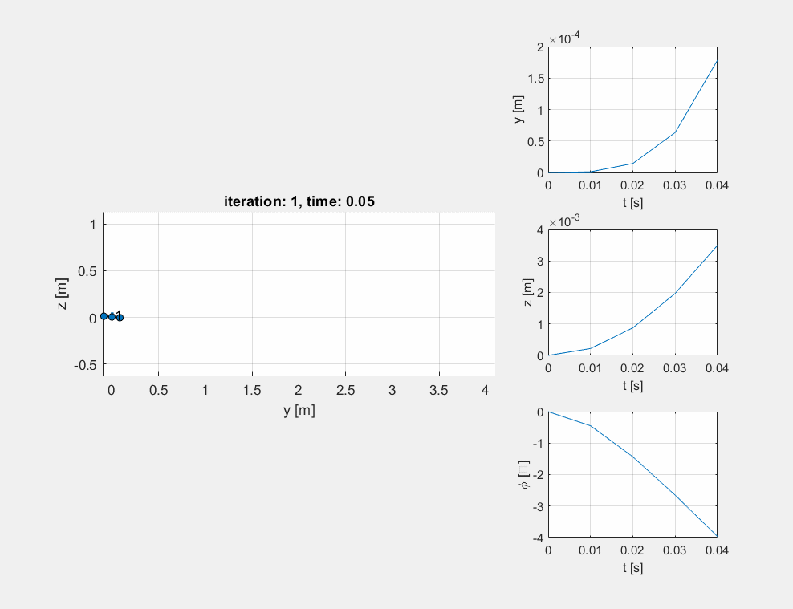
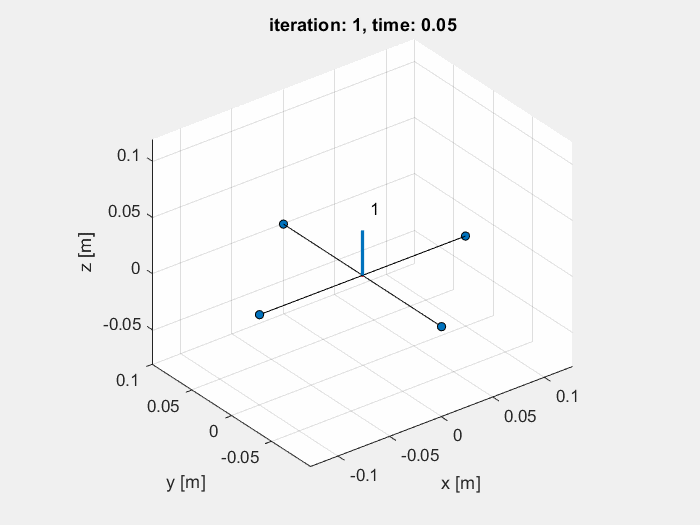
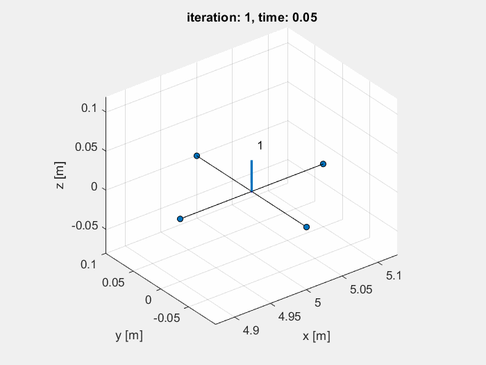

This directory contains my assignments from Aerial Robotics course (Coursera) offered by University of Pennsylvania.
1. Quadrotor Dynamics
2. Quadrotor Control
3. Quadrotor Trajectory Generation
4. Control of Multiple Robots

2D Quadrotor Control

3D Quadrotor Control - Line Tracking

3D Quadrotor Control - Helix Tracking

3D Quadrotor Control - Trajectory Generation

